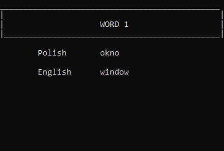
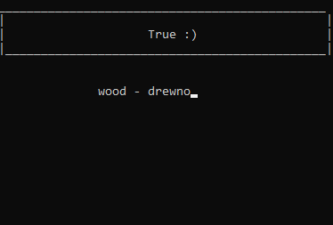
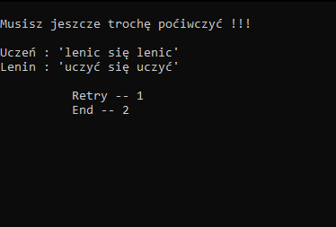

# LearningVocabulary

Learning Vocabulary służy do tworzenia i uczenia się własnych fiszek w języku anglielskim.

## General Information

W aplikacji musisz wpisać pięć słówek, które chcesz przyswoić.  
Należy je wpisać w języku polski jak i angielskim następnie  
program przeniesie Cię do nauczania gdzie wpisujesz polskie nazyw słówek wyswietlonych na ekranie.  
Na końcu aplikacja informuje cię czy na wszystkie słówka odpowiedziałeś poprawnie i  
daje Ci wybór czy chcesz powrórzyć nauczanie czy zakończyć pracę z programem.

## Technology 
 Aplikacja napisana w programie:
* Visual Studio 2019

 Język programowania:
* C++
## Screenshots

## Setup
 W celu uruchomienia aplikacji należy uruchomić plik "KsiazeGwynned.exe",  
 lub uruchomić plik "KsiazeGwynned.sln" i uruchomienie z poziomu programu Visual Studio 2019.
 
## Usage
 Program został stworzony jednynie w celu rozrowykowym.  
 
## Authors
* https://github.com/SebastianHarasim
* https://github.com/DominikGwizdala
* https://github.com/AndrzejKuchta

